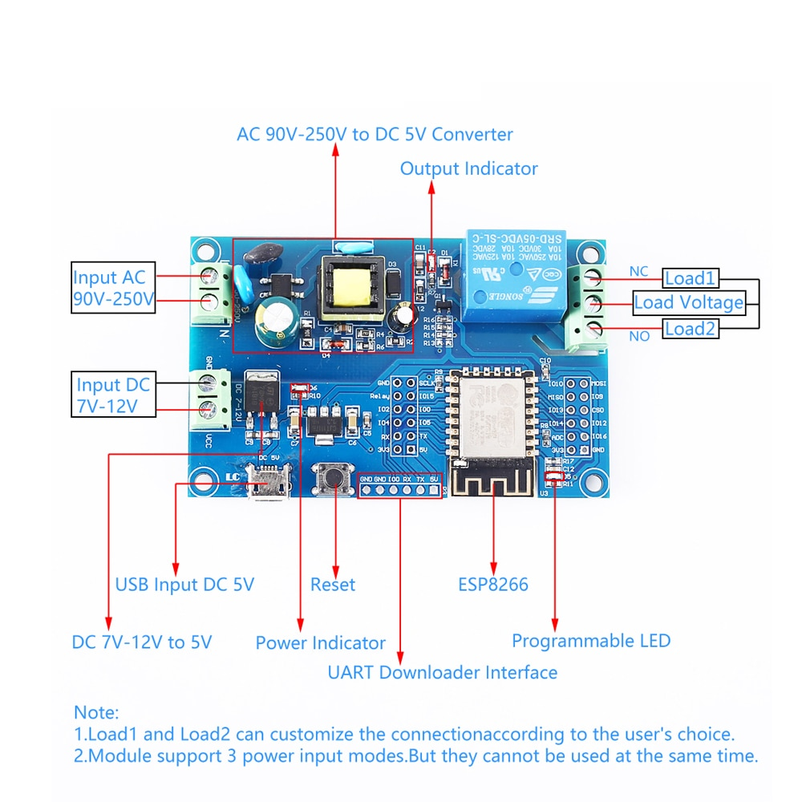
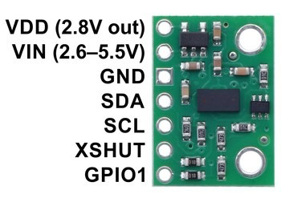

# SknSonOffGarageDoorProvider

<a href="https://homieiot.github.io/">
  
</a>

This is the ESP8266 Version, the ESP32 Version is called SknGarageDoorProvider in GitHub.

## HomieNode V3 (ESP8266-12F) featuring:
#### Node: sknSensors/GarageDoor/positionService/{range|status|signal|ambient|ranging|direction} [mixed...]
- VL53L1x Time of Flight Sensor capturing distance reading every 280 milliseconds once triggered.
- Assumes the distance being measured is one to eight feet.
- Runs in continuous capture mode once triggered for the seconds indicated as `duration`, set in the config.
- Additional to determine mm value limits for door OPEN=`rangerOpenMM` and for CLOSED=`rangerClosedMM`.

#### Node: sknSensors/GarageDoor/relayService/operate {ON|OFF}
- Operates the Relay for `relayHoldTimeMS`, as set in config, when triggered.

#### Node: sknSensors/GarageDoor/provider/operator/set [OPEN|CLOSE]
- Settable() node which controls the operation of relayService and positionService to operate Door to Open or Closed position.
- Frequent verifies door position by triggering positionService every `positionIntervalSec` seconds as indicated in config.
- Ignores OPEN or CLOSE commands if door is already in commanded positon.

#### Common Public APIs:
* bool isReady()                            Is Node ready and communicating?
* void operate()                            Trigger node's action

## Components
### ESP8266 Relay Module, ESP-12F Development Board AC 220V DC 12V Single relay module

### VL53L1x Time of Flight Ranging module, 4M max distance; configured for 8 feet US



## Homie Config: data/homie/config.json
```
{
  "name": "Garage Door Operator",
  "device_id": "GarageDoor",
  "device_stats_interval": 900,  
  "wifi": {
    "ssid": "<wifi-host>",
    "password": "<wifi-password>"
  },
  "mqtt": {
    "host": "<mqtt-hostname-or-ip>",
    "port": 1883,
	"base_topic": "sknSensors/",
    "auth": true,
    "username": "<mqtt-username>",
    "password": "<mqtt-password>"
  },
  "ota": {
    "enabled": true
  },
  "settings": {
    "relayHoldTimeMS": 400,
	  "positionIntervalSec": 60,
    "duration": 45,
    "rangerClosedMM": 2000,
    "rangerOpenMM": 200
  }
}
```

## Homie Serial Runtime Log
```
23:49:37.802 > 💡 Firmware SonOff Door Operator (3.0.0)
23:49:37.802 > 🔌 Booting into normal mode 🔌
23:49:37.984 > {} Stored configuration
23:49:37.984 >   • Hardware device ID: c45bbe64ee02
23:49:37.990 >   • Device ID: GarageDoor
23:49:37.990 >   • Name: SonOff Garage Door Operator
23:49:37.995 >   • Device Stats Interval: 300 sec
23:49:37.995 >   • Wi-Fi: 
23:49:38.000 >     ◦ SSID: SFNSS1-24G
23:49:38.000 >     ◦ Password not shown
23:49:38.000 >   • MQTT: 
23:49:38.006 >     ◦ Host: openhab.skoona.net
23:49:38.006 >     ◦ Port: 1883
23:49:38.011 >     ◦ Base topic: sknSensors/
23:49:38.011 >     ◦ Auth? yes
23:49:38.011 >     ◦ Username: openhabian
23:49:38.016 >     ◦ Password not shown
23:49:38.016 >   • OTA: 
23:49:38.016 >     ◦ Enabled? yes
23:49:38.022 >   • Custom settings: 
23:49:38.022 >     ◦ relayHoldTimeMS: 400 (set)
23:49:38.027 >     ◦ positionIntervalSec: 60 (set)
23:49:38.027 >     ◦ duration: 45 (set)
23:49:38.033 >     ◦ rangerOpenMM: 200 (set)
23:49:38.033 >     ◦ rangerClosedMM: 2000 (set)
23:49:38.074 > 〽 Medium distance mode accepted.
23:49:38.074 > 〽 200us timing budget accepted.
23:49:38.090 > ↕ Attempting to connect to Wi-Fi...
23:49:38.282 > ✔ Wi-Fi connected, IP: 10.100.1.113
23:49:38.287 > Triggering WIFI_CONNECTED event...
23:49:38.287 > ↕ Attempting to connect to MQTT...
23:49:38.318 > Sending initial information...
23:49:38.437 > ✔ MQTT ready
23:49:38.437 > Triggering MQTT_READY event...
23:49:38.437 > 〽 Node: Relay Service Ready to operate.
23:49:38.442 > 〽 Node: Ranging Service Ready to operate.
23:49:38.447 > 〽 Node: Controller Ready to operate.
23:49:38.447 > Calling setup function...
23:49:38.453 >  ✖  Start continuous ranging @ 250 ms accepted. ts: 962
23:49:38.458 > 〽 Sending statistics...
23:49:38.458 >   • Interval: 305s (300s including 5s grace time)
23:49:38.464 >   • Wi-Fi signal quality: 100%
23:49:38.469 >   • Uptime: 0s
23:49:38.469 > 📢 Calling broadcast handler...
23:49:38.469 > Received broadcast level alert: OH3 Offline
23:49:38.474 > 📢 Calling broadcast handler...
23:49:38.480 > Received broadcast level LWT: HomieMonitor Offline!
23:49:38.669 > 〽 range: 347 mm 	status: range valid raw: 0	signal: 19.66 MCPS	ambient: 0.51 MCPS Direction: 
23:49:38.914 > 〽 range: 348 mm 	status: range valid raw: 0	signal: 19.15 MCPS	ambient: 0.53 MCPS Direction: 
23:49:39.164 > 〽 range: 349 mm 	status: range valid raw: 0	signal: 19.05 MCPS	ambient: 0.55 MCPS Direction: 
23:49:39.414 > 〽 range: 349 mm 	status: range valid raw: 0	signal: 19.16 MCPS	ambient: 0.53 MCPS Direction: 
23:49:39.664 > 〽 range: 349 mm 	status: range valid raw: 0	signal: 19.16 MCPS	ambient: 0.55 MCPS Direction: 
23:49:39.914 > 〽 range: 350 mm 	status: range valid raw: 0	signal: 19.13 MCPS	ambient: 0.53 MCPS Direction: IDLE
23:49:40.164 > 〽 range: 348 mm 	status: range valid raw: 0	signal: 19.13 MCPS	ambient: 0.54 MCPS Direction: IDLE
23:49:40.414 > 〽 range: 349 mm 	status: range valid raw: 0	signal: 19.25 MCPS	ambient: 0.53 MCPS Direction: IDLE
23:49:40.664 > 〽 range: 348 mm 	status: range valid raw: 0	signal: 19.30 MCPS	ambient: 0.54 MCPS Direction: IDLE
23:49:40.914 > 〽 range: 349 mm 	status: range valid raw: 0	signal: 19.16 MCPS	ambient: 0.54 MCPS Direction: IDLE
23:49:41.164 > 〽 range: 349 mm 	status: range valid raw: 0	signal: 19.09 MCPS	ambient: 0.54 MCPS Direction: IDLE
23:49:41.414 > 〽 range: 348 mm 	status: range valid raw: 0	signal: 19.33 MCPS	ambient: 0.52 MCPS Direction: IDLE
23:49:41.664 > 〽 range: 349 mm 	status: range valid raw: 0	signal: 19.09 MCPS	ambient: 0.55 MCPS Direction: IDLE
23:49:41.914 > 〽 range: 349 mm 	status: range valid raw: 0	signal: 19.35 MCPS	ambient: 0.52 MCPS Direction: IDLE
23:49:42.164 > 〽 range: 349 mm 	status: range valid raw: 0	signal: 19.21 MCPS	ambient: 0.54 MCPS Direction: IDLE

...

23:49:55.164 > 〽 range: 350 mm 	status: range valid raw: 0	signal: 19.39 MCPS	ambient: 0.53 MCPS Direction: IDLE
23:49:55.414 > 〽 range: 348 mm 	status: range valid raw: 0	signal: 19.37 MCPS	ambient: 0.53 MCPS Direction: IDLE
23:49:55.664 > 〽 range: 348 mm 	status: range valid raw: 0	signal: 19.29 MCPS	ambient: 0.55 MCPS Direction: IDLE
23:49:55.914 > 〽 range: 350 mm 	status: range valid raw: 0	signal: 19.38 MCPS	ambient: 0.54 MCPS Direction: IDLE
23:49:56.164 > 〽 range: 349 mm 	status: range valid raw: 0	signal: 19.42 MCPS	ambient: 0.53 MCPS Direction: IDLE
23:49:56.413 > 〽 range: 348 mm 	status: range valid raw: 0	signal: 19.30 MCPS	ambient: 0.54 MCPS Direction: IDLE
23:49:56.664 > 〽 range: 348 mm 	status: range valid raw: 0	signal: 19.27 MCPS	ambient: 0.55 MCPS Direction: IDLE
23:49:56.914 > 〽 range: 349 mm 	status: range valid raw: 0	signal: 19.27 MCPS	ambient: 0.55 MCPS Direction: IDLE
23:49:57.163 > 〽 range: 350 mm 	status: range valid raw: 0	signal: 19.34 MCPS	ambient: 0.53 MCPS Direction: IDLE
23:49:57.414 > 〽 range: 349 mm 	status: range valid raw: 0	signal: 19.32 MCPS	ambient: 0.54 MCPS Direction: IDLE
23:49:57.664 > 〽 range: 348 mm 	status: range valid raw: 0	signal: 19.38 MCPS	ambient: 0.53 MCPS Direction: IDLE
23:49:57.914 > 〽 range: 348 mm 	status: range valid raw: 0	signal: 19.31 MCPS	ambient: 0.54 MCPS Direction: IDLE
23:49:58.163 > 〽 range: 348 mm 	status: range valid raw: 0	signal: 19.35 MCPS	ambient: 0.53 MCPS Direction: IDLE
23:49:58.413 > 〽 range: 349 mm 	status: range valid raw: 0	signal: 19.46 MCPS	ambient: 0.52 MCPS Direction: IDLE
23:49:58.445 >  ✖  Stopping continuous ranging accepted. ts: 20954
23:50:03.665 >  ✖  〽 handleInput -> property 'operator' value=close
23:50:03.665 >  ✖  [Start] Operating Door
23:50:03.670 >  ✖  [Start] Operating Relay pin: 5 level: 1 Hold: 400 Fast: 0
23:50:04.066 >  ✖  [Stop ] Operating Relay
23:50:04.066 >  ✖  [Stop ] Operating Door
23:50:04.066 >  ✖  Start continuous ranging @ 250 ms accepted. ts: 26586
23:50:04.289 > 〽 range: 348 mm 	status: range valid raw: 0	signal: 18.89 MCPS	ambient: 0.50 MCPS Direction: IDLE
23:50:04.534 > 〽 range: 349 mm 	status: range valid raw: 0	signal: 18.95 MCPS	ambient: 0.51 MCPS Direction: IDLE
23:50:04.787 > 〽 range: 349 mm 	status: range valid raw: 0	signal: 19.26 MCPS	ambient: 0.53 MCPS Direction: IDLE
23:50:05.037 > 〽 range: 349 mm 	status: range valid raw: 0	signal: 19.15 MCPS	ambient: 0.54 MCPS Direction: IDLE
23:50:05.287 > 〽 range: 349 mm 	status: range valid raw: 0	signal: 19.42 MCPS	ambient: 0.52 MCPS Direction: IDLE
23:50:05.537 > 〽 range: 348 mm 	status: range valid raw: 0	signal: 19.38 MCPS	ambient: 0.53 MCPS Direction: IDLE
```

## Contributing

1. Fork it 
2. Create your feature branch (`git checkout -b my-new-feature`)
3. Commit your changes (`git commit -am 'Add some feature'`)
4. Push to the branch (`git push origin my-new-feature`)
5. Create a new Pull Request


## License

The project is available as open source under the terms of the [MIT License](http://opensource.org/licenses/MIT).
